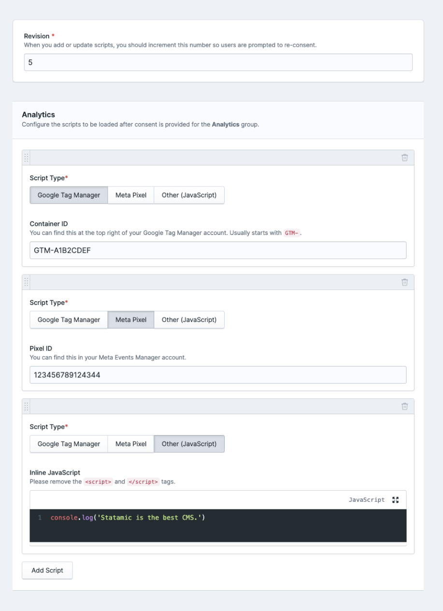
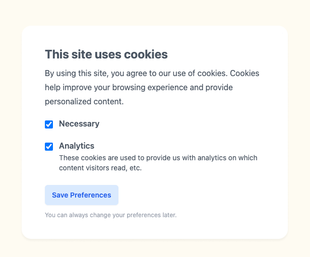

## Installation

1. Require Cookie Notice as a Composer dependency:
    ```
    composer require duncanmcclean/cookie-notice
    ```
2. Publish the addon's configuration file:
    ```
    php artisan vendor:publish --tag=cookie-notice-config
    ```
3. Add the Cookie Notice tags to your layout(s). Make sure the `{{ cookie_notice:scripts }}` tag is in the `<head>` and the `{{ cookie_notice:widget }}` tag is near the top of the `<body>`.
    ```antlers
    <!doctype html>
    <html>
    <head>
        <!-- Add this... -->
        {{ cookie_notice:scripts }}
    </head>
    <body>
        <!-- And this... -->
        {{ cookie_notice:widget }}
    </body>
    </html>
    ```
4. That's it installed! You can now [configure the consent groups](#configuring-consent-groups) and [customize the widget](#customizing-the-widget).

## Configuring Consent Groups

By default, Cookie Notice ships with two consent groups: Necessary & Analytics. However, you should consider your own use and tweak the consent groups to suit the requirements of your site.

You can customize the consent groups in the `config/cookie-notice.php` config file.

```php
    'consent_groups' => [
        [
            'name' => 'Necessary',
            'handle' => 'necessary',
            'enable_by_default' => true,
        ],
        [
            'name' => 'Analytics',
            'handle' => 'analytics',
            'description' => 'These cookies are used to provide us with analytics on which content visitors read, etc.',
            'enable_by_default' => false,
        ],
    ],
```

For each consent group, you can provide the following options:

* `name` - This name will be displayed to the user.
* `handle` - The handle will be used as a unique identifier for this consent group.
* `description` - Optional. The description will be displayed alongside the group's name.
* `enable_by_default` - Optional. Determines whether the consent group will be enabled by default when users first visit your site. They'll still be able to disable the consent group if they wish.

## Managing Scripts

There's a couple of different ways you can manage scripts with the Cookie Notice addon.

### Via the Control Panel

This is likely the easiest way to manage scripts, since you (& your clients) can do it without needing to touch any code. You can access the "Manage Scripts" page in the Control Panel, under the "Utilities" section.



From the "Manage Scripts" page, you can configure the scripts to be loaded for each of the configured consent groups. For ease of use, Google Tag Manager & Meta Pixels can be added by simply providing the container ID or pixel ID.

You can also configure the "Revision" of your scripts. This is particularly useful if you want to ensure users provide re-consent when you add new scripts.

##### Permissions

To access the "Manage Scripts" page, users will need the `manage scripts` permission.

### Via code

The recommended way to load JavaScript based on the user's consent is by adding `type="text/plain" data-consent-group="analytics"` to any `<script>` tags:

```html
<script type="text/plain" data-consent-group="analytics">
    console.log('Running some analytics code...')
</script>
```

This will ensure that the script is only executed when the user provides consent for the `analytics` consent group.

## Events

If you need to run some specific JavaScript when the user provides or removes consent, you can listen for the `accepted` and `declined` events:

```js
window.CookieNotice.on('accepted', (consentGroup) => {
    if (consentGroup === 'analytics') {
        console.log('Running some analytics code...')
    }
})

window.CookieNotice.on('declined', (consentGroup) => {
    if (consentGroup === 'analytics') {
        console.log('Un-running some analytics code...')
    }
})
```

You may also listen for the `preferences_updated` event, which is dispatched whenever the user updates any of their consent preferences:

```js
window.CookieNotice.on('preferences_updated', (preferences) => {
    console.log('The user updated some preference...', preferences);
})
```

> Make sure your JavaScript is **after** the `{{ cookie_notice:scripts }}` tag, otherwise the `window.CookieNotice` object won't be available.

## Consent Widget

Cookie Notice ships with a minimal consent widget, allowing your users to easily accept or decline the configured consent groups.



### Building a custom widget

If you'd prefer to build your own consent widget, to gain more control over the appearance, you can. Follow these steps:

1. Create a new view in your `resources/views` directory. For example, `resources/views/components/cookie-notice.antlers.html`.
2. In your `cookie-notice.php` config file, update the `widget_view` option to point to your new view:
    ```php
    'widget_view' => 'components.cookie-notice',
    ```
3. Next, copy this boilerplate into your new view:
    ```antlers
    <!-- Start of Cookie Notice Widget -->
    <div id="cookie-notice" class="relative z-[999]">
        <div class="fixed bottom-6 right-6 bg-white p-6 sm:mx-auto sm:max-w-lg">
            <h2>This site uses cookies</h2>
            <ul>
                {{ consent_groups }}
                    <li>
                        <label for="group-{{ handle }}">
                            <input type="checkbox" id="group-{{ handle }}" name="group-{{ handle }}" class="w-4 h-4">
                            {{ name }}
                            {{ if description }}
                                <span>{{ description }}</span>
                            {{ /if }}
                        </label>
                    </li>
                {{ /consent_groups }}
            </ul>
            <button type="button" data-save-preferences>Save Preferences</button>
        </div>
    </div>

    <script>
        document.addEventListener('DOMContentLoaded', () => {
            window.CookieNotice.boot(
                document.getElementById('cookie-notice'),
                JSON.parse('{{ config | to_json }}')
            );
        });
    </script>
    <!-- End of Cookie Notice Widget -->
    ```
   * You can loop through each of the consent groups using the `{{ consent_groups }}` tag pair.
   * You can boot Cookie Notice's JavaScript by calling the `window.CookieNotice.boot()` method after the DOM has loaded. The first argument should be the root element of your widget, and the second argument should be the config object, which you can pass in using `{{ config | to_json }}`.
   * For each consent group, you need have a `group-{{ handle }}` input.
   * On the button, you need the `data-save-preferences` attribute so Cookie Notice can listen to `click` events.
4. Start customizing!

### Adding an "Update Preferences" button

After users provide consent when they first visit your site, they may wish to update their preferences at a later late. To make this possible, you should add an "Update Preferences" button somewhere on your site that'll re-open the consent widget.

You can place this button wherever you like - you just need to add the `data-show-cookie-notice-widget` attribute to the element:

```html
<button data-show-cookie-notice-widget>Update cookie consent</button>
```

## Translating

If your site uses a language other than English, you'll probably want to translate the "strings" in the Consent Widget and in the Control Panel. To do this, you'll need to create a JSON translations file:

1. If you don't already have one, create a `lang` directory in the root of your project.
2. Create a `{locale}.json` file in the `lang` directory. Replace `{locale}` with your locale.
3. In the JSON file, you may add key / value pairs for each of the strings you wish to translate:

```json
// lang/de.json

{
  "Accept": "Annehmen"
}
```

## Upgrading from v8.x to v9.x

Cookie Notice v9 is a complete overhaul of the addon, with a focus on making it easier to manage scripts and more flexibility around customizing the consent widget.

Follow these steps to upgrade to v9.x:

1. Delete the `cookie-notice.php` file from your `config` directory.
2. In your `composer.json` file, update the `duncanmcclean/cookie-notice` version to `^9.0`.
   ```json
   "duncanmcclean/cookie-notice": "^9.0"
   ```
3. Run `composer update duncanmcclean/cookie-notice --with-dependencies`.
4. Re-publish the addon's configuration file and update it as needed:
    ```
    php artisan vendor:publish --tag=cookie-notice-config
    ```
5. Make sure you're using **both** the `{{ cookie_notice:scripts }}` and `{{ cookie_notice }}` tags in your site's layout(s): 
    ```antlers
    <!doctype html>
    <html>
    <head>
        <!-- This should be in the <head> -->
        {{ cookie_notice:scripts }}
    </head>
    <body>
        <!-- And this should be near the top of the <body>. You can also do {{ cookie_notice:widget }} -->
        {{ cookie_notice }} 
    </body>
    </html>
    ```
6. If you were previously calling the `window.cookieNotice.hasConsent('group_name')` method, you should refactor your code to use [event listeners](#events) instead.
7. If you were previously loading Google Tag Manager or a Meta Pixel manually, you may now configure them in [the Control Panel](#via-the-control-panel).
8. If you were previously overriding the `notice` view in `resources/views/vendor/cookie-notice`, you will need to re-implement in a [custom widget](#building-a-custom-widget).